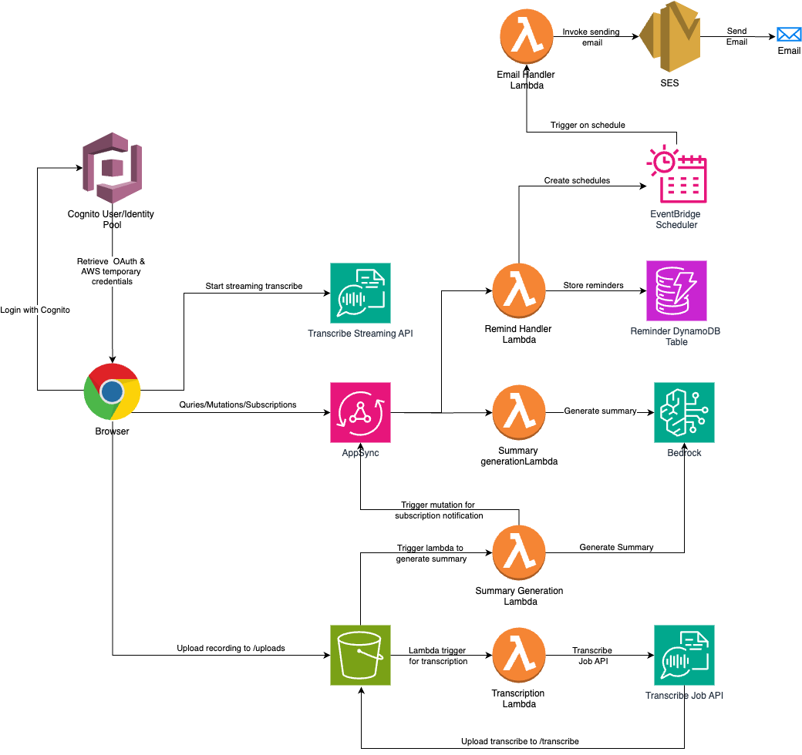

# CuddleScribe Healthcare Reminder System

A serverless healthcare reminder system built with AWS CDK, designed to help users manage their healthcare appointments and tasks effectively. The system provides automated email notifications with a user-friendly interface and reliable delivery mechanism.

- **Live Demo**: https://d3j9l9t024859x.cloudfront.net/

You can find a sample voice conversation to upload and test under the `sample-data` folder

## 🌟 Features

### 🎙️ Medical Consultation Recording & Transcription

- **Real-time Recording**: Capture doctor consultations as they happen
- **Upload Facility**: Import pre-recorded medical consultations
- **Smart Transcription**: Automatic conversion of speech to text using AWS Transcribe
- **AI-Powered Analysis**: Get intelligent summaries of medical conversations

### 👶 Development Milestone Tracking

- **Expert Knowledge Base**: Comprehensive information about child development (1-60 months)
- **Progress Monitoring**: Track your child's growth and developmental milestones
- **Custom Guidelines**: Receive personalized, age-appropriate developmental insights
- **Expert Tips**: Professional advice for each developmental stage

### ⏰ Smart Reminders

- **Medication Management**: Never miss important medications with timely alerts
- **Appointment Tracking**: Keep track of doctor visits and follow-ups
- **Milestone Alerts**: Get notified of upcoming developmental milestones
- **Smart Cleanup**: Automatic removal of completed reminders
- **Email Notifications**: Beautifully formatted, branded reminder emails

## 🏗️ Architecture



The system is built using the following AWS services:

- **AWS Lambda**: For all the data processing & computations 
- **Amazon EventBridge**: For scheduling and triggering reminders
- **Amazon DynamoDB**: For storing reminder information
- **Amazon SES**: For sending branded email notifications
- **Amazon Transcribe**: For converting medical consultation recordings to text
- **Amazon S3**: For secure storage of audio recordings and transcripts
- **AWS AppSync**: For GraphQL API and real-time data synchronization
- **Amazon Cognito**: For user authentication and access control
- **Amazon Bedrock**: For AI-powered medical conversation analysis
- **AWS CDK**: For infrastructure as code

## 🚀 Getting Started

### Prerequisites

- Node.js 18.x or later
- AWS CLI configured with appropriate credentials
- AWS CDK CLI installed (`npm install -g aws-cdk`)

### Installation

1. Clone the repository

2. Install dependencies:
   ```bash
   npm install
   ```
3. Configure AWS credentials

4. Configurations
     - Update the AWS account id, region and Cognito pool id in `bin/medical-convo-summarizer.ts`. You can find the Cognito pool ID after deploying the `https://github.com/sidathasiri/medical-convo-summarizer-web` project.
     - Update the `FROM_EMAIL_ADDRESS` in `lib/medical-convo-summarizer-stack.ts`. This is the email that you would use to send emails
     - Ensure the email addresses that you would use to send/receive are updated in SES as verified email addresses (if in SES sandbox mode)
     - Update the `bucketName` in `lib/medical-convo-summarizer-stack.ts`. This must be globally unique in S3.
     - Ensure you have access to the Nova Pro (`amazon.nova-pro-v1:0`) model in Bedrock

5. Deploy the stack:
   ```bash
   npx cdk deploy
   ```

## 🛠️ Development

### Project Structure

- `/src/functions/` - Lambda function implementations
- `/src/services/` - Service layer implementations (DynamoDB, EventBridge, Email)
- `/lib/` - CDK stack definition

### Available Commands

- `npm run build` - Compile TypeScript to JavaScript
- `npm run watch` - Watch for changes and compile
- `npm run test` - Run unit tests
- `npx cdk deploy` - Deploy stack to AWS
- `npx cdk diff` - Compare deployed stack with current state
- `npx cdk synth` - Emit CloudFormation template

## 🔒 Security

- All data is stored securely in DynamoDB
- Email notifications use Amazon SES for reliable delivery
- IAM roles follow the principle of least privilege

## 🤝 Contributing

1. Fork the repository
2. Create a feature branch
3. Commit your changes
4. Push to the branch
5. Open a Pull Request

## 👥 Support

For support, please open an issue in the repository or contact the maintainers.
